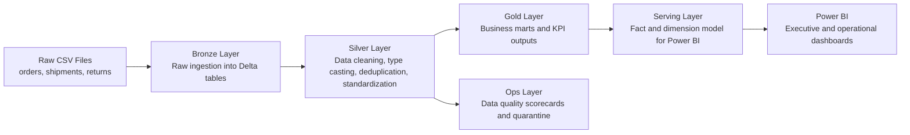

# Retail Fulfillment and Returns Intelligence

An enterprise-style data engineering project for **Databricks + Delta Lake + Power BI** using the **medallion architecture** and a **Power BI semantic model**.

This is designed as a **company-ready showcase**, not a classroom demo. It uses three operational source tables, cleans them through `bronze`, `silver`, and `gold`, adds **audit and data-quality controls**, and publishes both **business marts** and a **star-schema serving layer** for reporting.

## Why this project is useful

Large companies care deeply about:

- late deliveries
- rising return rates
- carrier performance
- discount leakage
- net realized revenue after refunds and shipping costs
- reliable pipelines with traceability and quality controls
- BI models that business teams can use without reworking raw tables

This project models a realistic retail and supply-chain analytics problem with only **3 raw source tables**:

1. `orders`
2. `shipments`
3. `returns`

That makes it simple enough to explain in interviews, while still showing real engineering thinking.

## What makes it company-ready

- clear `bronze`, `silver`, and `gold` separation
- data quality scorecards and rejected-record quarantine tables
- pipeline audit tables for observability
- reusable star schema for Power BI
- business marts for executive dashboards
- realistic dirty data with deduplication and standardization logic
- clean documentation you can present to recruiters, managers, and engineers

## Business problem

An omni-channel retail company wants to understand:

- Which regions and product categories generate the most revenue?
- Which carriers are causing delivery delays?
- Which products are most likely to be returned?
- How much revenue is lost because of returns, discounts, and poor delivery performance?

## Architecture



## Medallion layers

### Bronze

- Ingest raw CSV files into Delta tables
- Preserve original formats and messy values
- Add ingestion timestamps for traceability

### Silver

- Standardize date formats
- Clean currency and percentage columns
- Deduplicate records using latest update timestamp
- Normalize customer, city, state, carrier, and return reason values
- Handle nulls and invalid business values

### Gold

- Build an order-level analytics mart
- Build daily KPI summaries
- Build carrier performance summaries
- Expose Power BI-ready tables for reporting

### Ops and serving

- Track pipeline metrics across medallion layers
- Capture invalid records for triage
- Publish star-schema fact and dimension tables
- Create stable views for Power BI and SQL Warehouse access

## Repository structure

```text
.
|-- data/raw/
|   |-- orders.csv
|   |-- shipments.csv
|   `-- returns.csv
|-- databricks/notebooks/
|   |-- 00_project_setup.py
|   |-- 01_bronze_ingestion.py
|   |-- 02_silver_transformations.py
|   |-- 03_gold_serving.py
|   |-- 04_quality_and_audit.py
|   `-- 05_semantic_model_serving.py
|-- docs/
|   |-- company_ready_notes.md
|   |-- powerbi_dashboard_blueprint.md
|   |-- powerbi_semantic_model.md
|   |-- workflow_and_operating_model.md
|   `-- showcase_pitch.md
`-- src/
    `-- generate_sample_data.py
```

## Source tables

### `orders`

Contains sales transactions such as:

- order date
- customer
- geography
- product category
- quantity
- unit price
- discount percent
- promised delivery days

### `shipments`

Contains logistics information such as:

- carrier
- shipping mode
- ship date
- delivery date
- shipping cost
- warehouse
- delivery status

### `returns`

Contains post-sales issue tracking such as:

- return date
- return reason
- refund amount
- returned units
- resolution status

## Data quality issues intentionally included

To make the silver layer meaningful, the sample data includes realistic problems:

- mixed date formats
- duplicated orders and shipments
- inconsistent casing and extra spaces
- currency markers inside numeric columns
- percent symbols in discount fields
- missing state and segment values
- inconsistent carrier and return reason labels

## Gold tables for Power BI

### `order_service_mart`

One row per order with:

- sales metrics
- fulfillment metrics
- return metrics
- on-time flag
- delay days
- net realized revenue

### `daily_kpi_mart`

Daily and regional aggregated KPIs:

- order count
- gross revenue
- net sales
- on-time delivery rate
- return rate
- average delay days
- net realized revenue

### `carrier_performance_mart`

Carrier and shipping mode performance:

- shipment count
- delivered orders
- on-time rate
- average shipping cost
- return rate
- average delay

## Serving-layer star schema

### Dimensions

- `dim_date`
- `dim_customer`
- `dim_product`
- `dim_carrier`

### Fact table

- `fact_order_fulfillment`

This gives you a proper semantic model for Power BI instead of connecting visuals directly to a denormalized operational table only.

## Data quality and observability tables

### Quality tables

- `dq_orders_invalid`
- `dq_shipments_invalid`
- `dq_returns_invalid`
- `data_quality_scorecard`

### Audit tables

- `pipeline_run_audit`
- `table_freshness_audit`

## How to run locally

Generate the sample raw files:

```powershell
python src/generate_sample_data.py
```

## How to run in Databricks

1. Create a landing schema and raw volume for file ingestion:

```sql
CREATE SCHEMA IF NOT EXISTS main.retail_ops;
CREATE VOLUME IF NOT EXISTS main.retail_ops.raw;
```

2. Upload the CSV files from [data/raw](data/raw) into the volume path:

```text
/Volumes/main/retail_ops/raw
```

3. Import the notebooks from [databricks/notebooks](databricks/notebooks).
4. Run the notebooks in order:
   1. [00_project_setup.py](databricks/notebooks/00_project_setup.py)
   2. [01_bronze_ingestion.py](databricks/notebooks/01_bronze_ingestion.py)
   3. [02_silver_transformations.py](databricks/notebooks/02_silver_transformations.py)
   4. [03_gold_serving.py](databricks/notebooks/03_gold_serving.py)
   5. [04_quality_and_audit.py](databricks/notebooks/04_quality_and_audit.py)
   6. [05_semantic_model_serving.py](databricks/notebooks/05_semantic_model_serving.py)
5. Connect Power BI to your Databricks SQL warehouse and import the serving views:
   1. `vw_powerbi_fact_order_fulfillment`
   2. `vw_powerbi_dim_date`
   3. `vw_powerbi_dim_customer`
   4. `vw_powerbi_dim_product`
   5. `vw_powerbi_dim_carrier`
   6. `vw_powerbi_daily_kpis`
   7. `vw_powerbi_carrier_performance`

## Power BI story

This project is designed to support a visually strong dashboard with:

- executive KPI cards
- revenue trend lines
- region-wise return heatmaps
- carrier benchmark comparisons
- delivery SLA analysis
- category-wise profit leakage views

See [docs/powerbi_dashboard_blueprint.md](docs/powerbi_dashboard_blueprint.md) for the full dashboard plan.

For the proper Power BI relationship model, see [docs/powerbi_semantic_model.md](docs/powerbi_semantic_model.md).

## What makes this impressive in interviews

- clear medallion architecture
- business-focused KPI design
- realistic data quality handling
- auditability and pipeline observability
- star-schema serving layer for BI consumption
- end-to-end analytics flow from raw data to BI
- easy explanation with enough depth for senior interviewers

See [docs/showcase_pitch.md](docs/showcase_pitch.md) for a presentation script.

For the enterprise positioning and upgrade path, see [docs/company_ready_notes.md](docs/company_ready_notes.md).

For workflow orchestration and operating guidance, see [docs/workflow_and_operating_model.md](docs/workflow_and_operating_model.md).

For full project documentation and manager/team-lead explanation notes, see [docs/project_documentation_and_manager_brief.md](docs/project_documentation_and_manager_brief.md).
